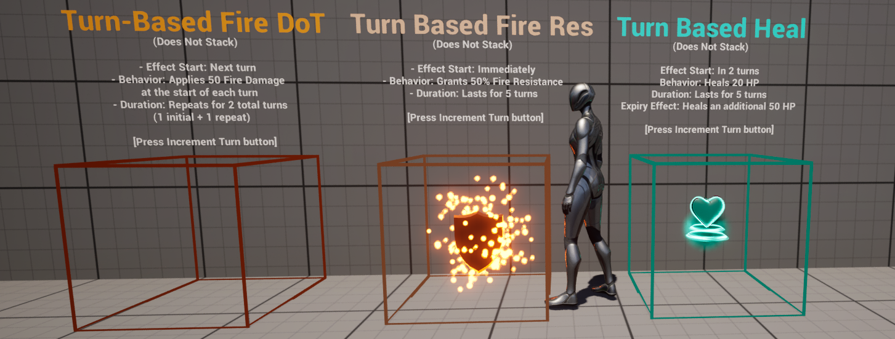
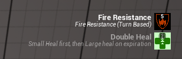

# Narxim's GAS Example
### A bare-bones Gameplay Ability System (GAS) example project to help you get started


_(5.0+)_Current_Version_(5.5)_-informational?style=flat-square)


## A fully-setup example project!
___

GAS has a lot of moving parts and can be quite daunting to wrap your head around at first glance.
I am providing this example project as a basis for learning how to properly set up your project to utilize all of its components.

There are obviously many ways to set up your project, but I believe this example provides a simple, versatile base to build upon, and especially to understand GAS as a whole.

This project is currently being updated, same for the documentation. Please be patient :)

---

<p>Note: The 5.4 update of this project has introduced significant changes in an attempt to simplify the setup and add some commonly used / requested features!</p>
___

### Includes:
- Thoroughly commented C++ code
- Example Blueprints
- Sample Attribute sets: Health (Includes Damage / Healing), Stamina,  Leveling, Resistance and Movement
- Stamina / Health Regeneration example (Based on Regeneration Attribute)
- "Ability System Initialization Data" structure for initializing the Ability System Component
- Ability Trigger / Release bindings tied directly to Enhanced Input (example)
- Commonly used example Ability Tasks
- Native Gameplay Tags example (NativeGameplayTags.h)
- Example UI elements with Attribute event bindings (In Game UI / Nameplate)
- Sample abilities (Jump, Hitscan, Sprint ...)
- Player Character and Non Player Character class examples
- Custom Character Movement Component interfaced with GAS
- Effect samples (Damage, armor buff/debuff, fire armor/damage, bleed status ...)
- Turn-Based GAS Example
- RogueLite Toolbox Plugin
___
Check out the **[Unreal Source Discord](https://discord.gg/unrealsource)** if you have any questions!
---
## Features
### Native gameplay tags
[Gameplay tags defined in C++](https://github.com/Narxim/Narxim-GAS-Example/blob/master/Source/GAS_Example/AbilitySystem/Data/NativeGameplayTags.h) only, without the need to declare them in DefaultGameplayTag.ini
___
### Attribute Sets
We are providing different attribute sets, with a BP implementation for each.


That's a best practice (Based on working experience), that's not only for Attributes Sets, but for any C++ class that might get reference by another object.

If you have a BP implementation, and for example, you add some config variable on your C++ class, you'll be able to adjust them in the editor without even changing the reference from the C++ class to the new BP.
___
#### Health
This attribute set comes with:
- Current Health
- Maximum Health
- Health Regeneration

Current cannot go over Max, and will be proportionnaly adjusted if the Maximum is changing (down or up).

Adjustments are done using a convenience method on the Base attribute set, called in PostAttributeChange (which is called whenever an attribute is changing, from both temporary and base adjustments).

Health Regeneration is used by an infinite GE, granting health back per second.

Once Current Health attains the Maximum, we'll add a 
___
#### Stamina

Stamina is implemented in the same way as Health (Current / Max), with proportional adjustments, and regeneration.
Example for Stamina Regen:


___
#### Leveling System

Press NumPad -/+ (or Up/Down) to Level up your character.
This will reevaluate all Attribute initializers and adjust the Maximum atttributes, adjusting the Current values that might be linked.

All GAs and GEs will also have their levels updated (Except if they have the Effect.NoLevel tag).

GEs using Curve tables with multiple levels in them will now use the right leveled value.
___
#### Resistance

We've implemented LoL (League of Legends) Armor system:
- Resistance is based on 100
- Resistance attribute can go from -75 to +200
- Damage reduction is calculated as 100 / (100 - Resistance attribute)
- More armor will yield less return, while less that 100 will increase the damage.

We provide one Attribute set with one attribute: Resistance.
And with this one attribute, every type of damage can have their own resistance.
See [KaosSpectrum's idea of Armor / Resistance](https://www.thegames.dev/?p=165) for more information.

The UI will showcase how to access each resistance individually, with the in-game effect, live:


Middle is the current Resistance magnitude (0 - 25).
Top, showing the effective resistance, calculated with the previous formula.

The slider will show if it is good or bad, with the min/max.
___
### Ability System Initialization Data can be found in the Character class Blueprints.


You can specify:
- Which attribute sets to grant
- Initialize each attribute from a hard coded value or a Curve Float table ("CSV")
- Starting Gameplay Abilities
- Starting Gameplay effects
___
### GE Levels and Curve tables
You'll notice GEs are using Scalable floats for almost parameter: Duration, modifiers ...
Because Scalable float can be just a static value, or, use a curve table that will be matched with the level.

#### First: What is the Curve table ?
{{Curve Tables are another one of Unreal Engine's hidden gems. They are an excellent tool that can help bridge the gap between designer-created data and programmer-driven gameplay. It is heavily used by the gameplay abilities system.
...
- Curve Tables for defining two-dimensional numerical data. A series of X and Y points that define a curve that can be read at any point. For example a power curve that defines how a Ship's Hit Points increase as they level up.
- Curve Tables allow for reading interpolated values. Like curves in the rest of Unreal, they are a series of keys with X/Y positions and interpolation settings (constant, linear or cubic).
- A single Curve Table can have many rows each of which can be interpreted as float/integer/boolean. In comparison when creating a Data Tables, you must choose a struct that will be used for the data in each row.
- Both Curve Tables and Data Tables have separate composite varieties.
- Both Curve Tables and Data Tables support Blueprints, but Curve Tables' support is a little basic.
|text=Quoted material.
|author=[First M. Last](https://unreal-garden.com/tutorials/curve-tables/)
}}

This article will explain how to create, but not really how to use them in the GAS setting
#### Using a Curve table in a GE
IN PROGRESS.

#### Updating values in Curve table
Updating a Curve table is a manual step:

You can use a new file too. The source CSV (optional) can be stored anywhere ... your desktop etc ... BUT I STRONGLY ADVISE TO NOT DO THAT.

The reason is explained right now: You can set up your editor to always auto reimport from your CSV ...
First, configure your editor:


You can turn on auto create / delete if you wish, your choice.

Second, create a CSV folder at the root (or wherever ... just update the auto loading)


You can reate a subfolder if you wish, but it's optional.
Now, any change you make on the csv will be loaded automatically: you curve table will be updated.

You can see how the Curve table and the CSV are linked like this:


The fact that the "source path" is relative tell me it's stored in the project.

___
### Damage

The project comes with:
- Basic Direct Damage (Physical damage)
- Fire Damage
- Bleed Damage (Damage over Time / DoT)
___
### Resistance and Damage handling

All damage _should_ be applied server authoritative, through an execution, if possible.
The reason is simple: a game should avoid rubber-banding death. That's not something you can get away with.

We're providing multiple Gameplay Effects damage examples, all using [GameplayEffectExecutionCalculations](https://github.com/tranek/GASDocumentation?tab=readme-ov-file#4512-gameplay-effect-execution-calculation) (or called Execution, Exec cals) in 2 flavors:
- Simple version
- Advanced version

Any of those Exec can access:
- Source and Target Ability System Component
- Source and Target actors
- Source and Target tags
- GE's context and spec


___
#### Simple damage calculation

That's the [boiler plate implementation](https://github.com/Narxim/Narxim-GAS-Example/blob/master/Source/GAS_Example/AbilitySystem/Calculations/SimpleDamageGameplayEffectExecutionCalculation.cpp) for our project, using:
- One meta attribute called "Damage" that will be applied as "real damage" to Current Health.

The "Resistance" we talked about earlier is actually implemeted exactly as KaosSpectrum explained.
This version has a small downside though: You cannot applied more than one type of damage per Gameplay effect.
The reason: GE's asset tag will be used to calculate the right Resistance.

That's how our "Fire" Damage is implemented:
- Simple execution
- GE and some tags
___
#### Advanced damage calculation

This ["Advanced"](https://github.com/Narxim/Narxim-GAS-Example/blob/master/Source/GAS_Example/AbilitySystem/Calculations/DamageGameplayEffectExecutionCalculation.cpp) one allows for more than one damage type while retaining the ability.

The Exec will capture 2 damage attributes (Damage and ReceivedBleeding).
Inside the exec, the "same code" from the simple version will be ran, for each type of damage, but the Tags will be provided dynamically in there.

The GE doesn't have to provide any tags, all is handled in the Exec.

We also think it would be possible to handle multiple damage type using only one meta attribute, but for the sack of simplicity, 2 are used here.
___
### Test Volumes

This project provides several test volumes that are applying each different gameplay effects.

Feel free to have a look at the video
[](https://www.youtube.com/watch?v=QW6GwY8DV94)


#### Healing Volumes


#### Armor and Damage volumes


We are using only one Resistance Attribute.

#### Bleed Status (DoT)


We are using only one Resistance Attribute.

#### Fire Damage and Fire Resistance


We are using only one Resistance Attribute.
___
### Showing Gameplay effects on the UI


We just released a basic implementation of Effect UI elements, as seen previously.
The concept is very simple.


It starts with Gameplay effect having a special component:


This component allows developper to say "I want to show this Effect to the player" with some parameters:
- Title
- Description
- Icon / Material
- Specific Controller

The ASC has been modded with a new delegate:
```
DECLARE_DYNAMIC_MULTICAST_DELEGATE_TwoParams(FOnCustomGameplayEffectEventDelegate, const ECustomEffectEventType, EventType, const FActiveGameplayEffect&, Effect);
FOnCustomGameplayEffectEventDelegate OnCustomGameplayEffectEventDelegate;
```
It is called whenever an effect - with a UI Component - is applied to you.

UIs can now subscribe to this delegate, and that's what we've done with the UAbilitySystemWidget, with a Blueprint Effect bar


Once the Widget receives the event, it will create, or reuse, a controller.
The controller is there to create the Effect Widget, and control ALL of its parameters whenever something changed.


A basic implementation is delivered:


The basic functions are implemented:
- Updating Title, Desciption, Icon (on init)
- Updating Time and stack (Periodically)
But ... you can override them in C++ or BP if you wish.


With a basic Widget class


The Controller will spawn the Widget class it has (Base, or any you might want to create) and take ownership of it.

If the effect is removed, the controller will remove the widget and gets destroyed.
More stacks ? Update the stacks ...
Inhibition is also not taken in account (Widget will be dimmed).

The controller will be listening to those updates from the ActiveEffect Event sets:
```
// Subscribe to all available events on the gameplay effect event set, so that the controller can respond accordingly
	FActiveGameplayEffectEvents* const EventSet = ASC->GetActiveEffectEventSet(Handle);
	EventSet->OnEffectRemoved.AddUObject(this, &ThisClass::OnEffectRemoved);
	EventSet->OnStackChanged.AddUObject(this, &ThisClass::OnStackChanged);
	EventSet->OnInhibitionChanged.AddUObject(this, &ThisClass::OnInhibitionChanged);
	EventSet->OnTimeChanged.AddUObject(this, &ThisClass::OnTimeChanged);
```
___
### Turn-Based GAS Example
This system extends the Gameplay Ability System (GAS) to support turn-based mechanics, allowing effects like damage-over-time, delayed healing, or stat buffs/debuffs that activate/expire/tick across multiple turns.
(Developed by Steve (optimisor) and Light (light04) from UnrealSource)


#### Message from EvilHippo
_Special thanks to Light for making the prototype for Steve, and Steve for going through it and accepting publishing his work on this project!
Pretty sure this will come VERY handy for the various GAS users._

#### Setup Steps:
1. Implement the Turn System Interface 
   - Add `TurnSystemInterface.h` to your `GameState` class, this is required to manage the "Turn" (see `TurnExampleGameStateBase.h` for reference).  
2. Integrate Turn-Based Components
   - Add `TurnBasedGameplayEffect.h` and `TurnBasedGameplayEffectComponent.h` to your project.  
3. Create Turn-Based GameplayEffect
   - Create a Blueprint class with `TurnBasedGameplayEffect` as its parent.  
4. Configure Turn Logic
   - Open your Turn-Based GameplayEffect Blueprint and adjust settings under `Components -> Turn Based Support` (examples: `GE_Turn_Based_Double_Heal`, `GE_Turn_Based_Fire_DoT`, `GE_Turn_Based_Fire_Resistance_Buff`).  

#### Turn-Based Settings  
Under `Components -> Turn Based Support`:  

| Property                     | Description                                                                  |  
|------------------------------|------------------------------------------------------------------------------|  
| Inhibition Delay Turns       | Turns until the effect activates (0 = instant).                              |  
| Duration Turns               | Turns until the effect expires *after activation* (0 = expires immediately). |  
| GE To Apply On Uninhibition  | Optional GE triggered when the effect activates.                             |  
| GE To Apply On Removal       | Optional GE triggered when the effect expires.                               |  
| Enable Periodic GE           | If enabled, applies a GE every turn *after activation*.                      |  
| GE To Apply Periodically     | GE to trigger each turn (e.g., damage-over-time).                            |  
| Limit Periodic Applications  | Restrict how many times the periodic GE is applied.                          |  
| Max Periodic Applications    | Max triggers for the periodic GE.                                            |  

#### Key Notes
- Turn-Based GEs are **always infinite** – their lifespan is controlled by `Duration Turns`.  
- **Modifiers are optional**: Leave them empty if no buff/debuff stat change is needed.  

#### TLDR  
1. Inherit `TurnBasedGameplayEffect` in a Blueprint.  
2. Configure `Turn Based Support` settings:  
   - Set activation delay (`Inhibition Delay Turns`) and duration (`Duration Turns`).  
   - Add optional GEs for activation, expiry, or periodic effects (e.g., DoT).  
3. Effects auto-manage turn tracking – just call `Increment Turn` in your game loop.  

#### HUD



Adding the `Custom UI Component` will automatically show the gameplay effects on the HUD with tue Turn number on top:
- (X): Inhibition turns
- X: Turn remaining
___
## ChangeLog:
### 2025/03/20 (EvilHippo):
```
Substential update:
- Migrated ASC ownership to Character (fixed an issue with ActorInfo not in sync at start)
- Refactored CustomAbility:
Now includes variables for Montage to play + options
- Refactored CustomAbililty_ClientToServer
- Fixed deprecated input mapping using CurrentActivationInfo from CDO (not supported in 5.5): using primary instance. Might not work with InstancePerExecution.
- Fixed Sprint not working in MP (Still one issue: stays ON even if you don't have the stamina)

# CustomRogueLite:
- Refactored abilities, now using Montages from CustomAbility
- Melee attack now works in MP:
Trace will be done on client, and sent to server for processing using ClientToServer ability + TargetData
- Added Critical Damage/Chance + buff (missing the actual % for critical damage)
- Reworked Modifier listenen to include source (Instigator / Target / All)
- Fixed Melee + Dash working in MP
- Press E will grant a Critical Damage buff to the player
- Added a modifier to Melee: +X damage (random) to each hit.
```
### 2025/03/07 (EvilHippo):
```
Sprint + CMC Update
- Added Custom CMC
- Added Sprint ability + Movement Attributeset / Multipliers
- Added GetMaxSpeed() handling of new Speed Multiplier from GAS

Press Shift to Sprint.
```
### 2025/02/16 (EvilHippo):
```
TurnBase Update:
- Now can be shown as "Active effect like others"
- Inhibited effect from the start will trigger showing the effect icon (especially for Turn based effects)
- New Icons
- Refactor of some methods / new delegate to listen to turn changes
- Turn changes are now replicated to all clients.
- Changing turn by pressing T instead of clicking a button
```
### 2025/02/15 (Steve :Mushroom: / Light):
```
- Added Turn-Based functionality for GAS via C++ classes (TurnSystemInterface.h, TurnExampleGameStateBase.h, TurnBasedGameplayEffectComponent.h, TurnBasedGameplayEffect.h)
- Added 3 Turn-Based Examples
 1. Turn-Based Fire DoT
 2. Turn-Based Fire Res
 3. Turn Based Heal
- Added Increment Turn button + Turn Counter to UI
- Enabled `Show Mouse Cursor` (required to be able to click the Increment Turn button) 
```
### 2025/02/13 (EvilHippo):
```
First version of the new Custom RogueLite Toolbox (CRL)
- New Map
- New effects
- AGR Pro integrated for Melee damage
- Base abilities (Punch / Dash)
- Damage handling wth Backstab
- New Attribute set
- New TargetFinder to streamline Sphere (or other) traces using tag requirements (and more)

CRL fixes

- Now GA can register modifiers (from Attacker only for now)
- GA test Enh1 has been added: add random damage
- Various fixes
```
### 2025/01/20 (EvilHippo):
```
- Project is now available and setup for 5.5
- Added more features to UI Effect Bar: Inhibition, Duration, Stacks etc ....
- Added UE5Coro (not enabled by default). Requires MSVC 14.41+
- Added a "Very simple" Ranged Attack (Left Click) dealing damage.
- Added New Volume to "Inhibit" Fire resistance, and show that the UI Effect will be dimmed (As in Inhibited)
- Making more method BlueprintNativeEvent
```
### 2025/01/06 (EvilHippo):
```
- Adding a new Custom GE Component that can have custom CanApply in BP or C++
- Create a new GE Component to limit max instances of GEs without stacking policies
- Create a test volume for this new Component.
```

### 2025/01/05 (EvilHippo):
```
- Now shows Effects on the UI as long as a Custom UI Component has been added.
- Shows Title, Desc, Duration (updated) and stack count
- Inhibition is not yet shown
- Added a bunch of free icons (see Licence in Content/UI/Icons)
- Added a new Widget Effect Bar + Effect Widget + Effect Widget Controller. Have to add some more example.
```

### 2024/12/28 (EvilHippo):
```- Using one Resistance Attribute for all "Armors".
- Introduced Fire Damage, with a simple calculation exec
Simple: Simple Exec, no fancy things, everything handled with tags on GE "Base Kaos style"
Advanced: can specify more than one damage at the same time while retaining the same feature, and Damage GE doesn't have to have any specific tags
- Introduced Attribute Maxed out tag, to be able to drive regen (stop if already at max), or be able to do some other type of action if Maxed out (Like: Damage is increased if target has nax health ?)
- Reworked some C++ functions
- Created BP Implementation of all Attribute sets (Best practice: never use the C++ class directly in other objects)
- Created a Base Custom Ability
- Renamed Volumes and GEs associated with them
- Introduced new Resistance UI (showing off how you can get the right value for each resistance with only ONE attribute)
- Added some Gameplay cues for Damage / Armor / Fire / Bleeding
```

### 2024/12/19 (EvilHippo):
```General:
- Adjusted C++ (removing Pyramids, refactoring some methods)
- Added TEXT() Macro
- Replaced ASC in BaseCharacter with Custom ASC pointer.
- Renamed AbilitySystemFunctionLibrary to CustomAbilitySystemBlueprintLibrary
- Changed ASC Initializer arrays to sets (better handling when subclassing)
- Enabled replication push model (better network performance, easier control)

Gameplay:
- Added Levels (+AbilitySystemWidget update)
Can now use NumPad -/+ to increase the character level
Tag "NoLevel" can be used on GE that shouldn't be updated.
Level will be shown on the UI (Nameplate + HUD).
Levels will adjust values in GAs, GEs and Attributes that are using Scalable float with Curve floats (instead of hardcoded values)

- Added Curves floats for Attribute initialization (replaces floats with Scalable Floats)
Using CSVs and automatic Curve float update (Just change the CSV, the Curve will be updated automatically)

- Created BP implementation of the Attribute Sets:
Best practice: Try as much as possible to use BP instances instead of classes if reference somewhere.
```
